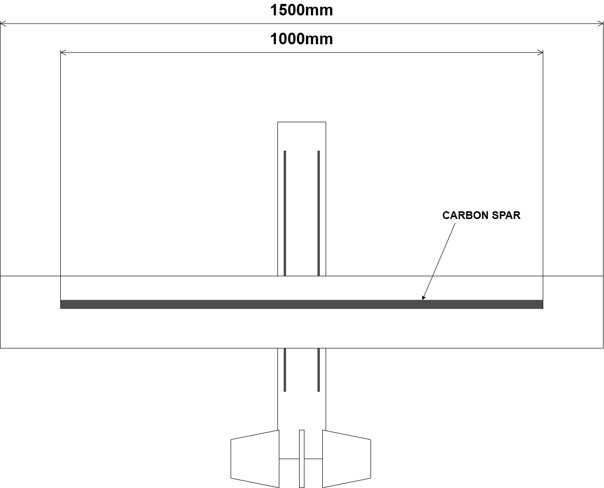

# VANT

**Vehiculo Aereo No Tripulado**

Mechanical project log for the VANT aircraft.

The repo is intentionally small. It keeps the current sketch, parts list, progress log, wiring note, and small Python tools.

## Files

- `PROJECT_LOG.md` - chronological progress log
- `BOM.md` - parts and sourcing
- `docs/electrical-wiring.md` - 6S LiPo, ESC, DC-DC, flight-controller wiring
- `programs/wing_calculator.py` - Python wing calculator
- `preliminary.drawio.png` - first dimension sketch

## Suggested Workflow

1. Add short updates to `PROJECT_LOG.md`.
2. Add parts to `BOM.md`.
3. Keep only useful current docs in `docs/`.
4. Put calculators and small scripts in `programs/`.

## License

No license has been selected yet. Treat all project files as private/all rights reserved until a license is added.
