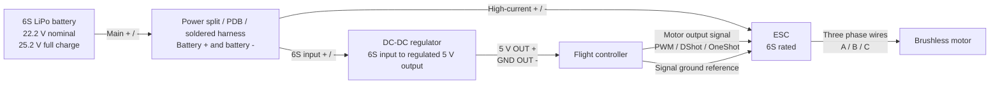

# VANT Electrical Wiring Diagram

This page describes the basic power and signal wiring for:

- 6S LiPo battery
- ESC
- Brushless motor
- Flight controller
- 6S-to-5V DC-DC regulator

Use this as a starting diagram only. Confirm every pinout against the actual ESC, flight controller, DC-DC regulator, and connector labels before powering the aircraft.

## Wiring Diagram

## Connection Table

| From | To | Connection | Notes |
| --- | --- | --- | --- |
| 6S LiPo positive | Power split positive | Main battery + | Use connector and wire gauge rated for motor current. |
| 6S LiPo negative | Power split negative | Main battery - | This becomes the common ground reference. |
| Power split positive | ESC battery positive | High-current + | ESC must be rated for 6S. |
| Power split negative | ESC battery negative | High-current - | Keep polarity correct. |
| Power split positive | DC-DC input positive | 6S input + | DC-DC must tolerate at least 25.2 V input. |
| Power split negative | DC-DC input negative | 6S input - | Connect to common battery negative. |
| DC-DC output positive | Flight controller 5V input | Regulated 5 V | Do not feed raw 6S into the flight controller. |
| DC-DC output negative | Flight controller GND | 5 V ground | Must share ground with ESC signal ground. |
| Flight controller motor output signal | ESC signal input | PWM / DShot signal | Use the FC motor output assigned to this motor. |
| Flight controller GND | ESC signal ground | Signal reference | Required for reliable ESC signal. |
| ESC phase A/B/C | Motor phase wires | Three motor wires | Swap any two motor wires to reverse motor direction. |

## Important Notes

- Remove the propeller before wiring, configuring, or testing the motor.
- The 6S LiPo connects to the ESC and to the DC-DC regulator in parallel through a power split, power distribution board, or soldered harness.
- The flight controller should receive regulated 5 V from the DC-DC regulator, not direct 6S battery voltage.
- All grounds must be common: battery negative, ESC negative, DC-DC ground, flight controller ground, and ESC signal ground.
- If the ESC has a built-in BEC and you are using the external DC-DC regulator, do not connect two 5 V sources to the same flight controller rail unless the hardware documentation explicitly allows it. Remove or insulate the ESC servo connector red wire if needed.
- Use a multimeter to verify DC-DC output polarity and voltage before connecting it to the flight controller.
- Add a fuse, smoke stopper, or current-limited bench supply for first power-up when possible.
- If battery voltage or current sensing is needed, use a proper power module or sensor rated for 6S. Do not connect raw 6S to flight-controller pins unless the specific pin is rated for it.
- Keep high-current battery and motor wires away from flight controller signal wiring when practical.

## First Power-Up Checklist

1. Propeller removed.
2. ESC rated for 6S.
3. DC-DC regulator rated for 6S input and enough 5 V output current.
4. Battery polarity checked at the power split.
5. DC-DC output verified near 5 V with a multimeter.
6. Flight controller receives only regulated 5 V.
7. ESC signal ground connected to flight controller ground.
8. Motor direction checked at low throttle.
9. If motor direction is wrong, swap any two ESC-to-motor phase wires.
