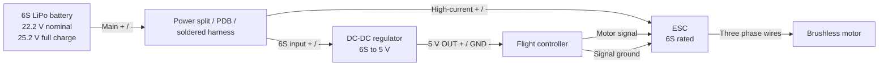

# VANT Electrical Wiring

Basic power and signal wiring for:

- 6S LiPo battery
- ESC
- Brushless motor
- Flight controller
- 6S-to-5V DC-DC regulator

Confirm every pinout against the actual ESC, flight controller, DC-DC regulator, and connector labels before powering the aircraft.

## Diagram

## Connections

| From | To | Connection | Notes |
| --- | --- | --- | --- |
| 6S LiPo | Power split | Battery + and - | Use wire and connector ratings above expected motor current. |
| Power split | ESC | Battery + and - | ESC must be rated for 6S. |
| Power split | DC-DC input | 6S + and - | DC-DC must tolerate at least 25.2 V input. |
| DC-DC output | Flight controller | Regulated 5 V and GND | Do not feed raw 6S into the flight controller. |
| Flight controller | ESC signal plug | Motor signal and GND | Ground is needed for reliable signal reference. |
| ESC | Motor | Three phase wires | Swap any two phase wires to reverse motor direction. |

## First Power-Up Checklist

1. Propeller removed.
2. ESC rated for 6S.
3. DC-DC regulator rated for 6S input and enough 5 V output current.
4. Battery polarity checked.
5. DC-DC output verified near 5 V with a multimeter.
6. Flight controller powered only from regulated 5 V.
7. ESC signal ground connected to flight controller ground.
8. Motor direction checked at low throttle.

If the ESC has a built-in BEC and the external DC-DC regulator is powering the flight controller, do not connect two 5 V sources to the same rail unless the hardware documentation explicitly allows it.
